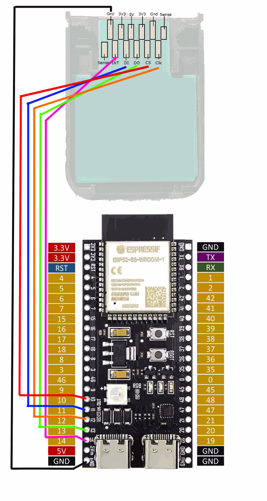
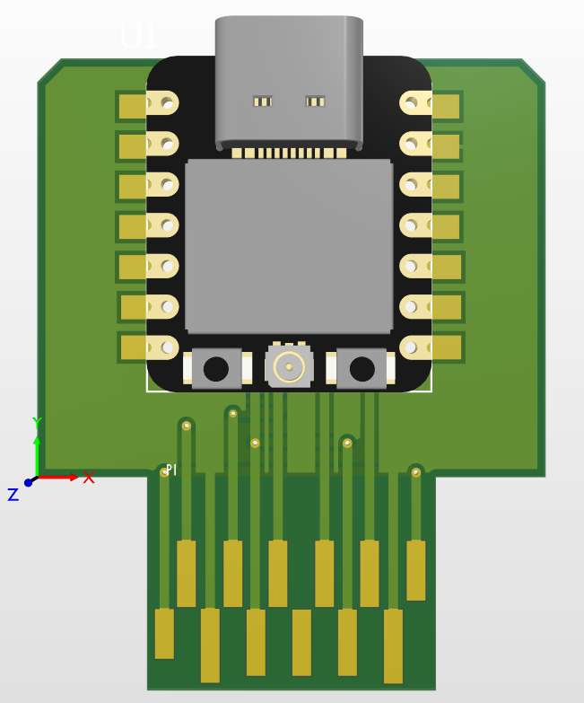

# wii-ra-adapter

**RetroAchievements on original Wii hardware — for both Wii and GameCube games — with no PC, no emulator and no game patching.**

The wii-ra-adapter is an ESP32-S3 firmware. The board plugs into the Wii's GameCube **memory card Slot B**, pretending to be an EXI device. It connects to your Wi-Fi, logs into [RetroAchievements](https://retroachievements.org), and runs the official [rcheevos](https://github.com/RetroAchievements/rcheevos) client — while the Wii, ~60 times per second, streams snapshots of the running game's RAM to it over the EXI bus. Achievements pop on real hardware, on real discs/backups, in real time.

This is the Wii/GameCube member of a family of adapters that started with the [nes-ra-adapter](https://github.com/odelot/nes-ra-adapter).

> **⚠️ Early release** — this is a very early version of the project. It already works, and you can have a lot of fun with achievements popping on real hardware today, but occasional errors and rough edges are expected. We count on the community to help test it — if something breaks, a bit of patience and an [issue](../../issues) report (or a message on [Discord](https://discord.gg/6eYGq7NNfF)) go a long way.

> **This repository is the distribution point**: releases here bundle the binaries of **all four projects** needed for a working setup (ESP32 firmware + WiiFlow Lite + d2x cIOS + Nintendont).

## The four projects

Getting achievements working on an unmodified game requires cooperating software in three places: the loader (PowerPC), the memory server (ARM/Starlet, running next to the game), and the brain (ESP32). Four projects cover both consoles:

| Project | Runs on | Role |
|---|---|---|
| **wii-ra-adapter** (this repo) | ESP32-S3 | The brain. Wi-Fi + RetroAchievements login, runs `rc_client`, decides which memory addresses to watch, evaluates achievements every frame, hosts a live web dashboard. |
| **[WiiFlow Lite (fork)](https://github.com/odelot/WiiFlow_Lite)** | Wii (PowerPC loader) | The front end for **Wii games**. Detects the adapter, computes the game's RA hash on-console, performs the `LOAD_GAME` handshake before booting, injects the VBlank hook + trophy overlay, and offers RA settings (including adapter credential reset). |
| **[d2x cIOS (fork)](https://github.com/odelot/d2x-cios)** | Wii (ARM/Starlet, IOS) | The memory server for **Wii games**: a new `ra-module` inside the custom IOS. Every VBlank it reads the watched addresses from game RAM (MEM1/MEM2), ships a snapshot to the ESP32 over EXI, and relays unlock events (LED blink + on-screen trophy). |
| **[Nintendont (fork)](https://github.com/odelot/Nintendont)** | Wii (ARM/Starlet, kernel) | The equivalent for **GameCube games**: an `ra_module` inside the Nintendont kernel. Computes the GC RA hash from the disc/ISO, does the handshake and the per-frame snapshot loop itself — loader, memory server and celebration (LED + overlay + rumble) all in one place. |

All four talk the same compact binary protocol ([`gc_ra_protocol.h`](main/gc_ra_protocol.h)), and the ESP32 firmware is console-agnostic: it identifies the game by its RA hash and lets the console side worry about where the bytes live.

## How it works

```
                        Wii console                                ESP32-S3 (memory card Slot B)
 ┌─────────────────────────────────────────────────┐             ┌────────────────────────────────┐
 │  PowerPC (game, unmodified)                     │             │  Core 1 (realtime)             │
 │   └─ C0 VBlank hook: frame counter + trophy     │   EXI bus   │   ├─ EXI/SPI slave             │
 │                                                 │  (SPI-like) │   └─ rc_client_do_frame()      │
 │  ARM "Starlet" (runs beside the game)           │◄───────────►│                                │
 │   ├─ Wii games: ra-module inside d2x cIOS       │  snapshots  │  Core 0 (network)              │
 │   └─ GC games:  ra_module inside Nintendont     │   events    │   ├─ Wi-Fi + HTTPS to RA       │
 │      (reads game RAM every VBlank)              │             │   └─ web dashboard (wii-ra.local) │
 └─────────────────────────────────────────────────┘             └────────────────────────────────┘
```

1. **Boot** — the loader (WiiFlow for Wii games, Nintendont for GC games) probes EXI channel 1 for the adapter (`IDENTIFY`), computes the game's RetroAchievements MD5 hash on-console, and sends `LOAD_GAME`.
2. **Load** — the ESP32 fetches the achievement set from the RA servers, compiles the list of memory addresses the achievements reference, and hands the console a **watchlist**.
3. **Play** — every VBlank the Starlet-side module reads the watched bytes straight out of the running game's RAM and sends a **snapshot**. Snapshots are queued on the ESP32 so no frame is lost, and each one is fed to `rc_client_do_frame()`, exactly like an emulator would with direct memory access.
4. **Unlock** — when an achievement triggers, the ESP32 submits it to RetroAchievements and sends an event back: the disc-slot LED blinks, a trophy indicator is drawn on screen, and (on GameCube) the controller rumbles. Connected browsers get a live toast via WebSocket.

The tricky part — achievements that chase **pointer chains** through RAM — is handled by a chain-descriptor table: the ESP32 compiles every eligible pointer chain into a flat table the console fetches once per game, so the console *walks the chains itself* in fresh RAM each frame and no round-trips are wasted resolving moved pointers. The watchlist also grows/shrinks incrementally at runtime, kept replica-consistent on both sides by sequence numbers.

### Wii games vs GameCube games

| | Wii games | GameCube games |
|---|---|---|
| Loader / handshake | WiiFlow Lite (before the IOS reload, while the PPC still owns EXI) | Nintendont kernel (background thread, game already running) |
| Memory server | `ra-module` in d2x cIOS | `ra_module` in the Nintendont kernel |
| RA hash | Computed on-console from the WBFS/ISO image (`rc_hash_wii_disc` port), with a game-ID fallback table on the ESP32 | Computed in-kernel from the disc/image (`rc_hash_gamecube` algorithm) |
| Frame sync | Gecko C0 VBlank hook injected by WiiFlow increments a MEM1 frame counter the ra-module polls (timer fallback if absent) | VBlank-synced from the Nintendont kernel |

## Hardware

Any ESP32-S3 board with PSRAM works; two board variants are wired in [`board_config.h`](main/board_config.h):

- **BOARD_DEV** — ESP32-S3 DevKit (WS2812 RGB status LED)
- **BOARD_XIAO** — Seeed XIAO ESP32S3 (tiny — fits inside a memory card shell)

Wiring to the GameCube memory card connector (Slot B):

| MC pin | Signal | S3 DevKit | XIAO ESP32S3 |
|---|---|---|---|
| 7 | 3.3V | 3.3V | 3.3V |
| 1 | GND | GND | GND |
| 3 | CS | GPIO10 | GPIO7 (D8) |
| 4 | CLK | GPIO12 | GPIO8 (D9) |
| 5 | DI (Wii → ESP) | GPIO11 | GPIO9 (D10) |
| 6 | DO (ESP → Wii) | GPIO13 | GPIO5 (D4) |
| 2 | INT | GPIO14 | GPIO6 (D5) |

The ESP32 acts as SPI slave on the EXI bus. The per-frame snapshot path (Wii games, d2x ra-module) runs at **16 MHz**; the boot handshake (WiiFlow) and the Nintendont module currently run at 8 MHz. A single EXI transaction carries up to 8 KB, enough for a full snapshot of 6144 watched addresses plus pointer-chain data.

## Getting Started

The full path from a stock Wii to achievements popping on screen:

1. [What you need](#what-you-need)
2. [Build the adapter](#1-build-the-adapter)
3. [Flash the ESP32-S3 firmware](#2-flash-the-esp32-s3-firmware)
4. [Softmod your Wii](#3-softmod-your-wii)
5. [Install the RA cIOS](#4-install-the-ra-cios)
6. [Copy the loaders](#5-copy-the-loaders)
7. [Turn the adapter on for the first time](#6-turn-the-adapter-on-for-the-first-time)
8. [Enable RetroAchievements in the loaders and play](#7-enable-retroachievements-in-the-loaders-and-play)

### What you need

- An **original Wii (RVL-001)** — the model with GameCube controller/memory card ports. The Wii Family Edition and Wii mini have no memory card slots, so the adapter has nowhere to plug in.
- An SD card for the Wii.
- An **ESP32-S3 board with PSRAM**. Two variants are supported out of the box (see [`board_config.h`](main/board_config.h)):
  - **ESP32-S3 DevKitC (N8R8)** — easiest for a hand-wired build
  - **Seeed XIAO ESP32S3** — tiny, for the compact PCB build
- A **GameCube memory card connector** — the cheapest source is gutting a third-party memory card — or the custom PCB (option B below).
- A USB-C cable for power/flashing.
- A [RetroAchievements](https://retroachievements.org) account.
- A **2.4 GHz Wi-Fi network** (the ESP32 does not support 5 GHz-only networks).

### 1. Build the adapter

**Option A — hand-wired dev board.** Solder wires from a memory card connector to the ESP32-S3 DevKit following the table in the [Hardware](#hardware) section above:

<center>

</center>


**Option B — compact PCB.** A miniaturized board that carries a XIAO ESP32S3 and slots straight into the memory card port:

<center>

</center>
<p>Disclaimer: We ordered but not tested yet</p>
<p>
Thanks <b>Sage2050</b> for design the PCB - <a href="https://github.com/sage2050/Wii_RA">https://github.com/sage2050/Wii_RA</a></p>


Optionally add a **passive buzzer** (DevKit: GPIO9 / XIAO: D3) for unlock jingles. Everything runs at 3.3 V — never feed 5 V into the memory card lines.

**Power**: the memory card slot does **not** power the ESP32-S3 — the board needs its own power through the USB-C port. The Wii's own USB ports work fine as a source, and so does any other 5 V USB supply (phone charger, power bank, etc.).

### 2. Flash the ESP32-S3 firmware

1. Download the release zip from the [Releases](../../releases) section and open the `firmware/` folder for **your board** (`esp32-s3-devkit` or `xiao-esp32s3`).
2. Install [esptool](https://docs.espressif.com/projects/esptool/en/latest/esp32s3/installation.html) (already present if you use the Arduino IDE or ESP-IDF).
3. Connect the board via USB and identify its COM port (e.g. `COM11` on Windows, `/dev/ttyACM0` on Linux).
4. From the folder with the three `.bin` files, run (adjust the port):

```
esptool --chip esp32s3 --port COM11 --baud 921600 --before default_reset --after hard_reset write_flash --flash_mode dio --flash_freq 80m --flash_size 8MB 0x0 bootloader.bin 0x8000 partition-table.bin 0x10000 wii-ra-adapter.bin
```

Both boards use the same command and offsets — only the folder (and its binaries) differs.

### 3. Softmod your Wii

The adapter requires a softmodded Wii with the Homebrew Channel. If yours isn't modded yet, follow [wii.hacks.guide](https://wii.hacks.guide/) — it is the best, safest resource. If you already have the Homebrew Channel, you can skip this step.

### 4. Install the RA cIOS

Wii games need the custom d2x cIOS with the `ra-module`. This installs into slots **248–251** only; your stock IOS and system menu are untouched. (If you already use slots 248–251 for another cIOS setup, note that these will be overwritten — the bundled WiiFlow expects exactly these slots.)

1. Make a backup of the `apps` folder on your Wii SD card.
2. Copy the contents of the release's `sd-card/` folder to the root of the SD card (this includes the `d2x-cios-installer` app used below, plus the loaders from step 5).
3. Insert the SD card in the Wii, open the **Homebrew Channel** and launch **d2x-cios-installer**.
4. Read the terms and press any button to continue.
5. Install **four** cIOS, one for each row of this table, using: *Select cIOS:* `d2x-v999-test`, *Select cIOS revision:* `65535`, and:

   | Select cIOS base | Select cIOS slot |
   |---|---|
   | 38 | 248 |
   | 56 | 249 |
   | 57 | 250 |
   | 58 | 251 |

   For each row: set the values, press **A**, press **A** again on the next page, and wait for the installation to finish. Then repeat for the next row.
6. When all four are installed, press **B** to exit and reboot the Wii.

### 5. Copy the loaders

If you followed step 4.2, the bundled **WiiFlow Lite** and **Nintendont** builds are already in the `apps` folder of your SD card, overwriting any stock versions (that's why you made a backup). They are up-to-date builds of the upstream projects plus the RetroAchievements support — everything else works as usual.

Also install games as you normally would (USB drive, SD card, or real discs — all work).

### 6. Turn the adapter on for the first time

1. With the Wii turned **off**, insert the adapter into GameCube memory card **Slot B**.
2. Power the ESP32-S3 through its USB-C port (the memory card slot does not power the board) — the Wii's own USB ports work fine as a power source, or use any 5 V USB charger.
3. Turn on the Wii.
4. On your phone or tablet, open the Wi-Fi settings and connect to the network **`WII_RA_ADAPTER`** (password: **`12345678`**).
5. A configuration portal opens automatically (if it doesn't, browse to `http://192.168.1.1`). There:
   - Tap **Configure WiFi** and select your home network (2.4 GHz).
   - Enter your Wi-Fi password.
   - Enter your **RA Username** and **RA Password** below.
   - Tap **Save**.
6. The adapter reboots and joins your network — the `WII_RA_ADAPTER` network disappearing from your Wi-Fi list means it worked.
7. Turn the Wii off and on again.

To redo this later (new Wi-Fi, new account), use **WiiFlow → Settings → RetroAchievements page → reset adapter credentials** — the adapter wipes its stored credentials and reopens the portal.

### 7. Enable RetroAchievements in the loaders and play

RetroAchievements support ships **disabled by default** in both loaders — enable it once:

- **WiiFlow** (Wii games): **Settings → RetroAchievements page → On**. When you switch it on, WiiFlow probes the adapter and warns you if it isn't detected.
- **Nintendont** (GameCube games): in the settings list, set **RetroAchievements** to **On**.

Then just launch a game. The loader shows the boot progress on screen (detecting adapter → Wi-Fi → login → game hash → downloading achievements) and waits for the adapter before starting — typically 5–20 s on the first load of a game. When an achievement unlocks you get the on-screen trophy indicator, a disc-slot LED blink, and (on GameCube) a controller rumble.

### Troubleshooting

- **"Adapter not detected"** — check that the adapter is fully seated in memory card **Slot B** (not A), that it has USB power, and (for hand-wired builds) re-check the wiring table.
- **Login or download errors on boot** — the boot status line tells you which stage failed (Wi-Fi, login, game download). Wrong credentials? Reset them from WiiFlow's Settings and redo step 6.
- **A game identifies but has no achievements** — the game needs an achievement set on retroachievements.org, and your dump must match the RA database hash. For Wii games in particular, **scrubbed WBFS images hash incorrectly** — use accurate (unscrubbed) dumps.
- **Live status** — while playing, open `http://wii-ra.local/` from any device on your network to watch the adapter in real time (see below).
- **Still stuck?** Open an [issue](../../issues) or ask in the [Discord community](https://discord.gg/6eYGq7NNfF).

### Live web dashboard

While a game is running, open **`http://wii-ra.local/`** from any device on the same network: game info, achievement list with live progress, unlock toasts, challenge indicators and rich presence — pushed over WebSocket, with zero cost to the console when no client is connected.

## Downloads

Each release on this repository bundles everything from the [Getting Started](#getting-started) guide:

```
wii-ra-adapter-vX.Y.Z.zip
├─ firmware/
│  ├─ esp32-s3-devkit/     bootloader.bin, partition-table.bin, wii-ra-adapter.bin
│  └─ xiao-esp32s3/        bootloader.bin, partition-table.bin, wii-ra-adapter.bin
└─ sd-card/                copy the contents to the root of your Wii SD card
   └─ apps/
      ├─ wiiflow/            WiiFlow Lite build with RA support
      ├─ nintendont/         Nintendont build with RA support
      └─ d2x-cios-installer/ installer for the d2x cIOS build with the ra-module
```

Sources for the console-side projects live in their own repositories (forks of [wiidev/d2x-cios](https://github.com/wiidev/d2x-cios), [WiiFlow Lite](https://github.com/Fledge68/WiiFlow_Lite) and [FIX94's Nintendont](https://github.com/FIX94/Nintendont)).

## Support & community

Questions about the installation, something not working as expected, or found a bug? Open an [issue](../../issues) or join the community on [Discord](https://discord.gg/baM7y3xbsA).

## Credits

- [RetroAchievements](https://retroachievements.org) and [rcheevos](https://github.com/RetroAchievements/rcheevos) — the achievement runtime this project embeds
- [nes-ra-adapter](https://github.com/odelot/nes-ra-adapter) — the ancestor of this design
- The d2x cIOS, WiiFlow Lite and Nintendont communities, whose work makes running anything on this hardware possible
- [WiFiManager](https://github.com/tzapu/WiFiManager) for the credential portal

## Disclaimer

This project is intended for use with games you legally own. It comes with no warranty; you are responsible for anything you install on your console.
